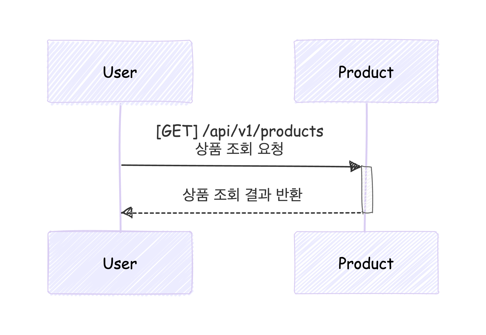
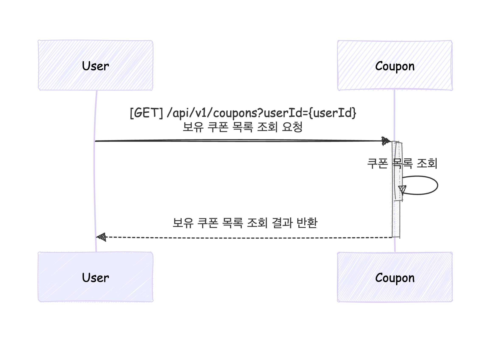
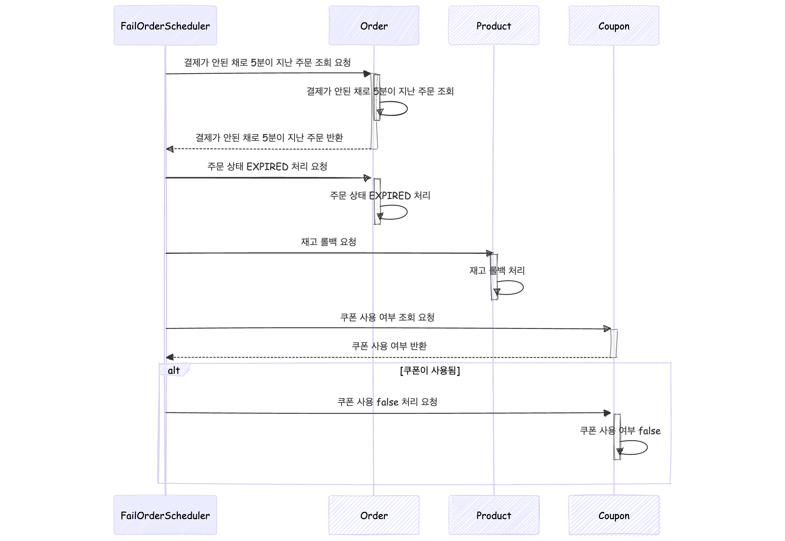
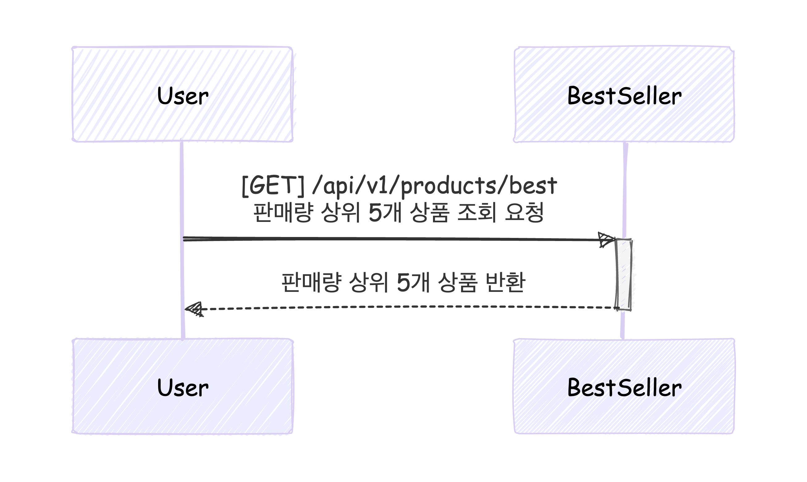

# 시퀀스 다이어그램

## 1. 잔액 충전 및 이력 저장

## 2. 잔액 조회 및 충전 결과 반환

## 3. 상품 조회 및 결과 반환

## 4. 선착순 쿠폰 발급 처리 및 결과 반환

## 5. 보유 쿠폰 목록 조회

## 6. 주문 생성 및 자격조건 처리

## 7. 포인트 결제 처리 및 주문 상태 업데이트

## 8. 주문 완료 후 주문 상태 EXPIRED 처리 및 쿠폰 사용 취소

## 9. 주문 완료된 상품 조회 및 일별 주문량 저장

## 10. 판매량 상위 5개 상품 조회

